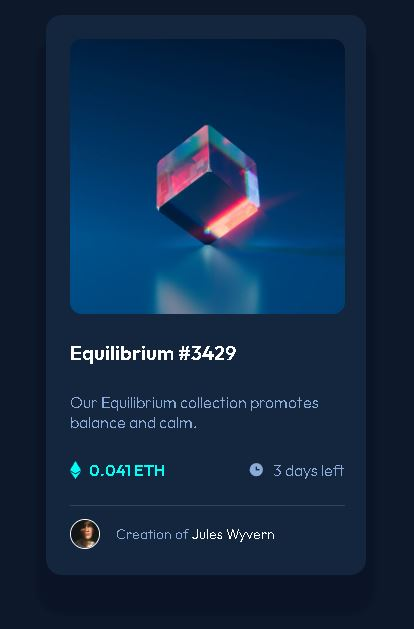

# Frontend Mentor - NFT preview card component solution

This is a solution to the [NFT preview card component challenge on Frontend Mentor](https://www.frontendmentor.io/challenges/nft-preview-card-component-SbdUL_w0U). Frontend Mentor challenges help you improve your coding skills by building realistic projects. 

## Table of contents

  - [The challenge](#the-challenge)
  - [Screenshot](#screenshot)
  - [Links](#links)
  - [My process](#my-process)
  - [Built with](#built-with)
  - [What I learned](#what-i-learned)
  - [Author](#author)

### The challenge

Users should be able to:

- View the optimal layout depending on their device's screen size
- See hover states for interactive elements

### Screenshot

### Links

- Solution URL: [https://ebaroth.github.io/Frontend-Mentor---nft-preview-card-component-main/]

## My process

As usual went from HTML to CSS, starting with creating the container and placing elements inside (here as a column). Then mostly add to deal with the hover of the image to add the background-color and make the SVG appear in the center.

### Built with

- Semantic HTML5 markup
- CSS custom properties
- Flexbox
- Transition

### What I learned

Add to go through hover to deal with the main image. How to use an after pseudo-element to add color to an image on hover. Also this is the first project I use REM instead of px for most of the elements. Really useful to place them directly in the :root at first to make everything neat and easy/ready to use.

## Author

- Frontend Mentor - [@eBaroth](https://www.frontendmentor.io/profile/eBaroth)

